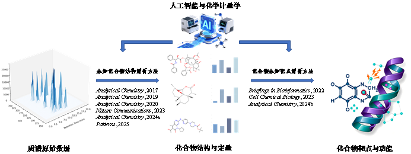
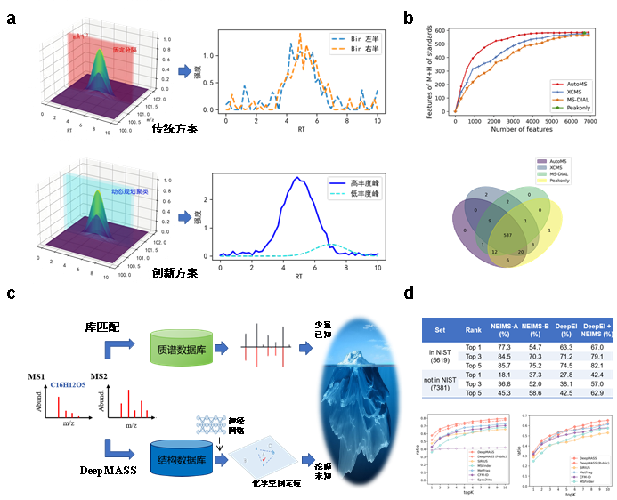
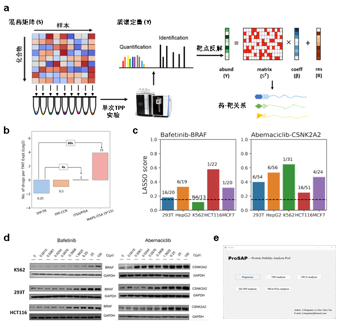
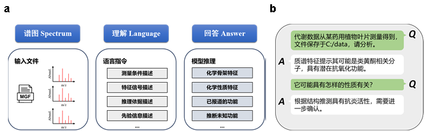
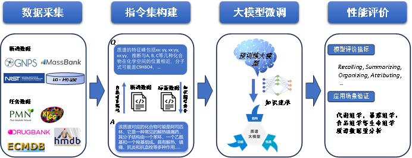
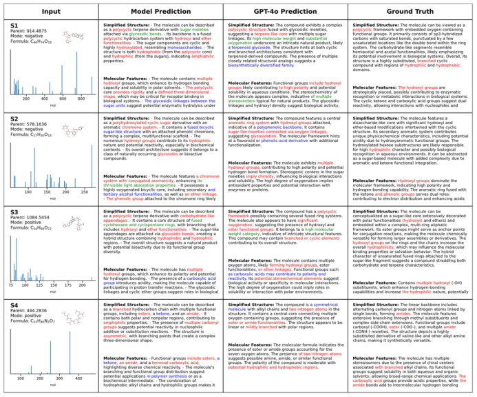

# Research

Our research focuses on the core scientific challenge of **deciphering the structure and function of unknown small molecules based on mass spectrometry (MS) technology**. Using chemometrics and artificial intelligence as core approaches, we systematically develop methodologies for MS data analysis, forming a series of distinctive analytical frameworks and algorithmic tools.

*Figure 1. Overview of research achievements*

---

## 1. Structure Elucidation of Unknown Compounds

### Background & Challenge

Liquid chromatography–mass spectrometry (LC-MS) is a core technology for analyzing complex biological samples. However, two key bottlenecks limit our ability to systematically identify unknown compounds:

1. **Signal separation**: In complex samples, co-eluting signals and background noise obscure low-abundance or structurally novel compounds, making reliable feature extraction difficult.
2. **Structure annotation**: Current compound identification heavily relies on spectral library matching. The limited coverage of reference libraries means that many potential metabolites and novel compounds remain unannotated.

### Our Approach

We have developed a series of innovative methods addressing these challenges from raw data processing to structure annotation:

#### KPIC: Pure Ion Chromatogram Extraction

Traditional tools (e.g., XCMS, MZmine, MS-DIAL) rely on fixed mass tolerance binning to generate extracted ion chromatograms (XIC), which can lead to peak splitting at bin edges and noise masking of low-abundance signals. We proposed a **dynamic programming-based pure ion clustering strategy (KPIC)** that replaces fixed-bin approaches with data-driven optimal 1D k-means clustering, adaptively identifying signal clusters closest to each feature ion while removing noise.

> **Key advantage**: Feature extraction accuracy of 97.1% vs. 95.8% (XCMS) vs. 93.8% (MS-DIAL); signal-to-noise ratio significantly higher than alternative pure ion extraction method PITracer (7.52 vs. 3.61).

!!! note "📄 Paper"
    **Ji, H.**; Lu, H.; Zhang, Z. Pure Ion Chromatogram Extraction via Optimal k-Means Clustering. *RSC Adv.* 2016, 6 (62), 56977–56985.

#### AutoMS: Deep Learning-Based Peak Quality Scoring

Conventional peak quality assessment relies on signal-to-noise ratio (SNR) thresholds, which lack objectivity for complex samples. We developed **AutoMS**, a deep denoising autoencoder (DAE)-based method for continuous scoring of LC-MS peak quality. By learning the common features of true chromatographic peaks and reconstructing denoised ideal peak shapes, AutoMS quantifies peak quality as the difference between original and reconstructed signals, enabling flexible false positive rate control.

!!! note "📄 Paper"
    **Ji, H.**\*; Tian, J. Deep Denoising Autoencoder-Assisted Continuous Scoring of Peak Quality in High-Resolution LC−MS Data. *Chemometr. Intell. Lab.* 2022, 231, 104694.

#### DeepMASS: Chemical Space Positioning for Library-Free Structure Annotation

We proposed a fundamentally different strategy for structure annotation. Instead of:
- Summarizing fragmentation rules to generate simulated spectra (e.g., MS-Finder), or
- Predicting molecular fingerprints via machine learning (e.g., SIRIUS),

**DeepMASS** models fragment peak collections as learnable structural semantic representations, converting them into structure-related numerical vectors. The correlation between vectors reflects the structural similarity between compounds, enabling an implicit mapping from mass spectra to molecular structure. For unknown spectra, DeepMASS locates structurally similar neighboring molecules in chemical space and scores candidate structures based on the positions of known neighbors.

> **Key advantage**: Top-1 annotation accuracy on CASMI dataset: 57.7% (DeepMASS) vs. 44.7% (SIRIUS) vs. 36.1% (MS-Finder); on natural product test set: 46.8% vs. 38.4% vs. 7.8%.

Building on DeepMASS, we further integrated HNSW-based approximate nearest neighbor search for millisecond-level single-spectrum matching, and developed a federated cross-institutional retrieval framework for privacy-preserving distributed structure annotation.

!!! reference "Papers"
    - **Ji, H.**; Xu, Y.; Lu, H.; Zhang, Z. Deep MS/MS-Aided Structural-Similarity Scoring for Unknown Metabolite Identification. *Anal. Chem.* 2019, 91 (9), 5629–5637.
    - **Ji, H.**; Deng, H.; Lu, H.; Zhang, Z. Predicting a Molecular Fingerprint from an Electron Ionization Mass Spectrum with Deep Neural Networks. *Anal. Chem.* 2020, 92 (13), 8649–8653.
    - Yang, Q.#; **Ji, H.**#; et al. Ultra-Fast and Accurate Electron Ionization Mass Spectrum Matching for Compound Identification with Million-Scale in-Silico Library. *Nat. Commun.* 2023, 14 (1), 3722.

*Figure 2. Overview of unknown compound structure elucidation methods. (a) Dynamic programming clustering strategy for improved feature extraction; (b) Higher consistency and accuracy compared to traditional methods; (c) Chemical space positioning strategy for library-free structure annotation; (d) Significantly improved accuracy of DeepMASS compared to alternative methods.*

#### Biosynthetic Pathway-Aware Structure Generation

We also proposed a **graph-sequence enhanced Transformer framework** that learns structure generation grammar and evolutionary constraints specific to biological systems. This approach characterizes system-specific chemical space distributions, enabling accurate prediction of biosynthetic pathways and intermediates. It generates biologically plausible novel structures that have not yet been observed, providing a source-constrained, structurally reasonable candidate set for improving unknown compound annotation.

!!! note "📄 Paper"
    *Patterns*, 2025.

---

## 2. Target Deconvolution of Unknown Compounds

### Background & Challenge

MS-based proteomics methods for compound target identification (e.g., DARTS, TPP) are essential for understanding drug and toxin mechanisms. However, traditional methods analyze only one compound per experiment, making large-scale screening prohibitively expensive and time-consuming. While pooling strategies can improve front-end throughput, they still require individual deconvolution during positive sample confirmation.

### Our Approach

#### MAPS: Matrix-Augmented Pooling Strategy

We proposed the **MAPS** strategy, whose core innovation lies in introducing a decodable matrix-based combinatorial encoding at the experimental design level. A measurement matrix guides the mixing of multiple compounds according to specific rules, giving each compound a unique "presence pattern" across different pooled samples. At the computational level, a combination-response matrix correction model solves the MS quantitative signals inversely, accurately identifying the true active compounds from the mixed pools.

> **Key advantage**: Increases throughput by 10–100× while reducing costs by ~90% without sacrificing proteome coverage or target resolution accuracy. Combined with DIA, throughput can be further increased by 2–3×.

!!! note "📄 Paper"
    **Ji, H.**#; Lu, X.#; et al. Target deconvolution with matrix-augmented pooling strategy reveals cell-specific drug-protein interactions. *Cell Chem. Biol.* 2023, 30(11), 1478–1487.

#### DIA-TPP: Label-Free Thermal Proteome Profiling

Traditional thermal proteome profiling (including MAPS) typically relies on TMT labeling because protein abundance decreases significantly after heat treatment, making label-free DIA strategies challenging. We developed an **exogenous standard protein enhancement strategy** that introduces stable reference proteins into the DIA-TPP system, anchoring signals to improve overall detection limits and quantification accuracy. Mathematical correction then recovers actual quantitative abundances, enabling the efficiency advantages of DIA for MAPS workflows.

!!! note "📄 Paper"
    *Anal. Chem.*, 2024.

#### ProSAP: Standardized Analysis Software

We developed **ProSAP** (Protein Stability Analysis Pod), a standalone GUI software integrating multiple thermal proteomics experimental strategies. ProSAP provides one-click data analysis and visualization for TPP, NPARC, and iTSA workflows, significantly simplifying data processing.

> **Impact**: Downloaded over 1,400 times since release, used by researchers at Tsinghua University, Peking University, National University of Singapore, University of Northern Colorado, and others.

!!! note "📄 Paper"
    **Ji, H.**; Lu, X.; Zheng, Z.; Sun, S.; Tan, C.S.H. ProSAP: A GUI Software Tool for Statistical Analysis and Assessment of Thermal Stability Data. *Brief. Bioinform.* 2022, 23 (3), bbac057.

*Figure 4. Framework of compound target deconvolution methods. (a) High-throughput MAPS experimental workflow; (b) Efficiency comparison of MAPS vs. traditional approaches; (c) Novel drug-target interactions discovered by MAPS; (d) Experimental validation across different cell lines; (e) ProSAP software interface.*

---

## 3. Future Direction: General-Purpose Mass Spectrometry Large Language Model

### Vision

Existing MS data analysis methods generally build models around single prediction targets (e.g., structure features, physicochemical properties, drug-likeness, toxicity), ignoring the inherently coupled nature of these tasks in chemical space. We aim to build a **general-purpose mass spectrometry large language model (MS-LLM)** that enables joint multi-task inference, where structure elucidation, property prediction, and functional assessment mutually constrain and calibrate each other within a unified representation space.

### Core Innovation

We propose treating mass spectrometry data as a **"chemical language"** with intrinsic grammar and semantic structure. By encoding MS spectra as instruction-formatted representations understandable to large language models (e.g., Llama), the model can learn cross-semantic unified representations that produce consistent inference results across structure, property, and function levels.

Key innovations include:
1. **Data encoding**: Converting MS spectra into "natural language-like" encoding schemes
2. **Multi-task unification**: One model supporting 6+ task types (structure, property, function) with performance ≥90% of corresponding single-task models
3. **Instruction-driven fine-tuning**: Domain-specific instruction set for MS data understanding

*Figure 5. Framework of the general-purpose mass spectrometry large language model (a) and expected outcomes (b).*

*Figure 6. Technical roadmap for the general-purpose mass spectrometry LLM.*

### Preliminary Results

Preliminary experiments on compound classification and structure feature prediction show that our MS-instruction fine-tuned model significantly outperforms traditional CNN, MLP, and LSTM models, as well as general-purpose LLMs (GPT-4o, Qwen) without domain fine-tuning.

*Figure 7. Preliminary results of structure feature prediction. Red: correctly predicted features described in labels; Green: correctly predicted features not described in labels; Blue: incorrectly predicted features.*

---

## Academic Impact

Our research has received significant recognition from the international scientific community:

- **DeepMASS** was recognized as *"pioneering work"* in applying deep learning to compound identification ([Hong et al., *Annu. Rev. Anal. Chem.*, 2025](https://doi.org/10.1146/annurev-anchem-061025-133903)) and as *"a more powerful tool for detecting drug metabolites"* ([Yu et al., *Anal. Chem.*, 2022](https://doi.org/10.1021/acs.analchem.1c04156)).
- **DeepEI** (GC-EI/MS extension of DeepMASS) was described as the *"first attempt"* at using deep neural networks to directly predict molecular fingerprints from mass spectral data ([Huber et al., *J. Cheminform.*, 2021](https://doi.org/10.1186/s13321-021-00558-2)).
- **KPIC** has been integrated into the comprehensive patRoon software workflow for environmental sample analysis ([Helmus et al., *JOSS*, 2022](https://doi.org/10.21105/joss.04029)).
- **ProSAP** has been downloaded 1,400+ times and cited by leading institutions worldwide.
- The **DeepMASS web server** ([http://deepmass.cn](http://deepmass.cn)) has attracted 300+ registered users since its launch in January 2025.
- We organized a special issue on *"Deep Learning in Metabolomics"* in the journal *Metabolites* as guest editor.
