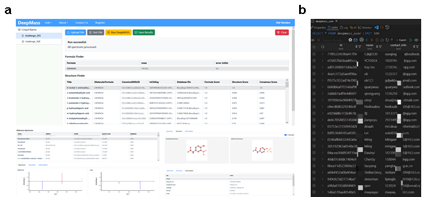

# Software & Tools

Our lab develops and maintains several open-source software tools for mass spectrometry data analysis, 
cheminformatics, and proteomics. All tools are freely available for academic use.

---

## Analytical tools for LC-MS/MS

### DeepMASS2

DeepMASS2 is a cross-platform GUI software tool that enables deep-learning based 
metabolite annotation via **semantic similarity analysis of mass spectral language**. 
Unlike traditional approaches that summarize fragmentation rules or predict molecular fingerprints, 
DeepMASS2 models fragment peak collections as learnable structural semantic representations, 
converting mass spectra into structure-related numerical vectors. This approach enables 
the prediction of structurally related metabolites for unknown compounds by locating 
them in chemical space relative to known structures.

*DeepMASS web interface and user database*

**Key Features:**
- Chemical space positioning strategy for library-free structure annotation
- HNSW-based approximate nearest neighbor search for millisecond-level matching
- Federated cross-institutional retrieval for privacy-preserving distributed annotation
- Web server available at [http://deepmass.cn](http://deepmass.cn) (300+ registered users)

**Web Links:** 
- [Homepage](https://github.com/DeepOmics-Lab/DeepMASS2_GUI)
- [Web Server](http://218.245.102.112/)

!!! note "📄 Paper"
    Under Review

---

## Analytical tools for GC-EI/MS

### FederEI

FederEI is a **federated library matching solution** for EI-MS-based compound identification. 
It establishes a server-to-server connection framework seamlessly integrated into a user-friendly 
front-end software. By keeping data localized within each laboratory's server, FederEI minimizes 
the need for sharing sensitive spectral information across multiple entities, 
thus mitigating privacy concerns.  

**Workflow**: The user submits mass spectrometry data through the UI, and FederEI dispatches it 
to the central server. The central server distributes the file to all client servers based on their 
IP addresses. Each client server searches its local database and transmits results back. The central 
server tallies responses and returns the final organized results to the user.

**Web Links:** 
- [Homepage](https://hcji.github.io/FederEI/)
- [Github Source](https://github.com/DeepOmics-Lab/FederEI)

!!! note "📄 Paper"
    Under Review

---

## Analytical tools for thermal proteomics

### ProSAP

**ProSAP** (Protein Stability Analysis Pod) is a standalone, user-friendly GUI software 
that provides an integrated analysis workflow for thermal shift assays. It includes five modules: 
data preprocessing, data visualization, TPP analysis, NPARC analysis, and iTSA analysis. 
Researchers can easily compare statistical strategies, analyze results, and draw conclusions 
from proteomics quantitative tables obtained from Proteome Discoverer or MaxQuant.

> **Impact**: Downloaded over 1,400 times since release. Used by researchers at Tsinghua University, 
> Peking University, National University of Singapore, University of Northern Colorado, and others.

**Web Links:** 
- [Homepage](https://hcji.github.io/ProSAP_Pages/)
- [Github Source](https://github.com/DeepOmics-Lab/ProSAP)

!!! note "📄 Paper"
    **Ji, H.**; Lu, X.; Zheng, Z.; Sun, S.; Tan, C.S.H. ProSAP: A GUI Software Tool for Statistical Analysis and Assessment of Thermal Stability Data. *Brief. Bioinform*. 2022, 23 (3), bbac057. [link](https://doi.org/10.1093/bib/bbac057)

### MAPS-iTSA

Target deconvolution is a crucial but costly and time-consuming task that hinders 
large-scale profiling for drug discovery. We present a **Matrix-Augmented Pooling Strategy (MAPS)** 
which mixes multiple drugs into samples with optimized permutation and delineates targets 
of each drug simultaneously with mathematical processing. We validated this strategy with 
thermal proteome profiling (TPP) testing of 15 drugs concurrently, **increasing experimental 
throughput by 60×** while maintaining high sensitivity and specificity. Benefiting from the 
lower cost and higher throughput of MAPS, we performed target deconvolution of the 15 drugs 
across 5 cell lines, revealing cell-specific drug-protein interactions.

*MAPS strategy: (a) High-throughput workflow; (b) Efficiency improvement vs. traditional approaches; (c) Novel drug-target interactions discovered; (d) Validation across cell lines; (e) ProSAP software.*

**Web Links:** 
- [Github Source](https://github.com/DeepOmics-Lab/MAPS-iTSA)

!!! note "📄 Paper"
    **Ji, H.**#; Lu, X.#; Zhao, S.; Wang, Q.; Bin, L.; Huber, K. V. M.; Luo, R.; Tian, R.; Tan, C. S. H. Target deconvolution with matrix-augmented pooling strategy reveals cell-specific drug-protein interactions. *Cell Chem. Biol*. 2023, 30(11) 1478-1487. [link](https://linkinghub.elsevier.com/retrieve/pii/S245194562300274X)

---

## Other bioinformatics software

### PyFingerprint

There are many types of chemical fingerprints for describing molecules provided by different tools, 
such as RDKit, CDK and OpenBabel. This package aims to summarize them all in PyFingerprint.

**Web Links:** 
- [Github Source](https://github.com/DeepOmics-Lab/PyFingerprint)

### KPIC2

An effective framework for mass spectrometry-based metabolomics using pure ion chromatograms. 
KPIC2 replaces traditional fixed-bin approaches with data-driven optimal k-means clustering 
for adaptive, data-driven pure ion screening and noise removal.

!!! note "📄 Paper"
    **Ji, H.**; Zeng, F.; Xu, Y.; Lu, H.; Zhang, Z. KPIC2: An Effective Framework for Mass Spectrometry-Based Metabolomics Using Pure Ion Chromatograms. *Anal. Chem*. 2017, 89 (14), 7631–7640. [link](https://pubs.acs.org/doi/10.1021/acs.analchem.7b01547)

### TarMet

A reactive GUI tool for efficient and confident quantification of MS-based targeted metabolic 
and stable isotope tracer analysis.

!!! note "📄 Paper"
    **Ji, H.**; Zhang, Z.; Lu, H. TarMet: A Reactive GUI Tool for Efficient and Confident Quantification of MS Based Targeted Metabolic and Stable Isotope Tracer Analysis. *Metabolomics* 2018, 14 (5), 68. [link](http://dx.doi.org/10.1007/s11306-018-1363-7)
